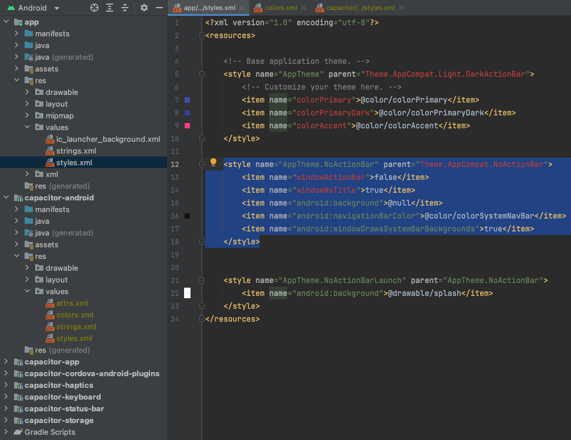
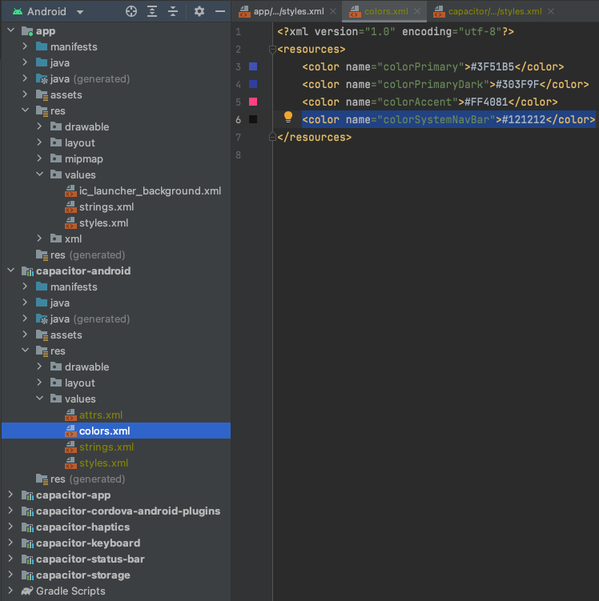

# algorand-wallet
Open source mobile wallet

# Development

## Setup

### 1. Install
`cd algorand-wallet/mobile`

`npm i`

### 2. Build app, and sync and open in Android Studio

Run `npm run android`


### Updating mobile style

*** To avoid having to update the Android files every time, `node_modules/`, which contains the Android files, should be committed to the repo.***

Capacitor generates the mobile files under `node_modules` which is gitignored. Must manually update the mobile system style:

```
<style name="AppTheme.NoActionBar" parent="Theme.AppCompat.NoActionBar">
    <item name="windowActionBar">false</item>
    <item name="windowNoTitle">true</item>
    <item name="android:background">@null</item>
    <item name="android:navigationBarColor">@color/colorSystemNavBar</item>
    <item name="android:windowDrawsSystemBarBackgrounds">true</item>
</style>
```



Add color for system navigation bar color:
```
<color name="colorSystemNavBar">#121212</color>
```




### Developement Troubleshooting

If you get the following error:
`SDK location not found. Define a valid SDK location with an ANDROID_HOME environment variable or by setting the sdk.dir path...`

Close Android Studio and enter `npx cap open android`.